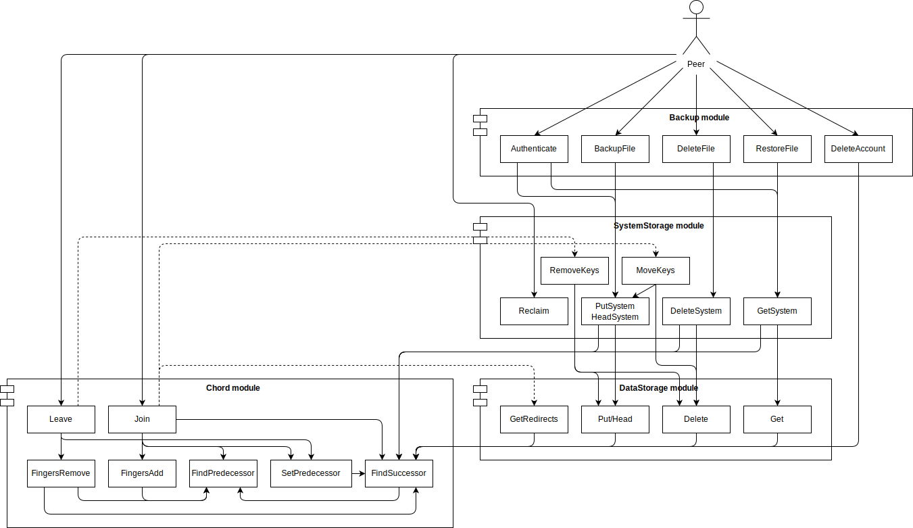

# Protocols

We have devised a system with a significant amount of different protocols; this was so we could reuse as much code as possible, and had the additional advantage that each protocol is quite easy to implement and easy to reason on, as each protocol aims at performing a very concrete (and often simple) task, and it is easy to understand which protocols will use which protocols. It has the inconvenience that the diagram depicting relations between protocols is quite dense.

The peer is allowed to directly use the following protocols:

\begin{multicols}{3}
    \begin{itemize}
        \itemsep0em
        \item Authenticate
        \item Join
        \item BackupFile
        \item RestoreFile
        \item DeleteFile
        \item Leave
    \end{itemize}
\end{multicols}

\newpage

## Definitions

Each chunk/datapiece has a key, which is a binary unsigned number with $m$ bits. This means there are $2^m$ different keys, from $0$ to $2^m-1$ inclusive. Let $M = 2^m$ be the modulus we are operating with.

The key space can be imagined as a circle of perimeter $M$, where 0 is in the intersection between the circle and the $yy$-positive axis, and keys increase in clockwise direction. Given a key $k$, we can thus say $k \equiv k + i \cdot M, \forall i \in \mathbb{Z}$).

The *distance* between nodes $a$ and $b$ is defined as the number of increments to $a$ that we need to arrive to $b$ in the modulus-$M$ space. That is, $distance(a, b) = (b-a+M) \mod M$. This distance can be interpreted as the distance from $a$ to $b$ in clockwise direction.

The *successor* of a key $k$ ($successor(k)$) is the next node after or at $k$; technically, $s = successor(k)$ is the node that minimizes $distance(k, s)$.

The *predecessor* of a key $k$ ($predecessor(k)$) is the previous node before or at $k$; technically, $p = precedessor(k)$ is the node that minimizes $distance(p, k)$.

A node $r$ is responsible for all keys for which their successor is $r$.

